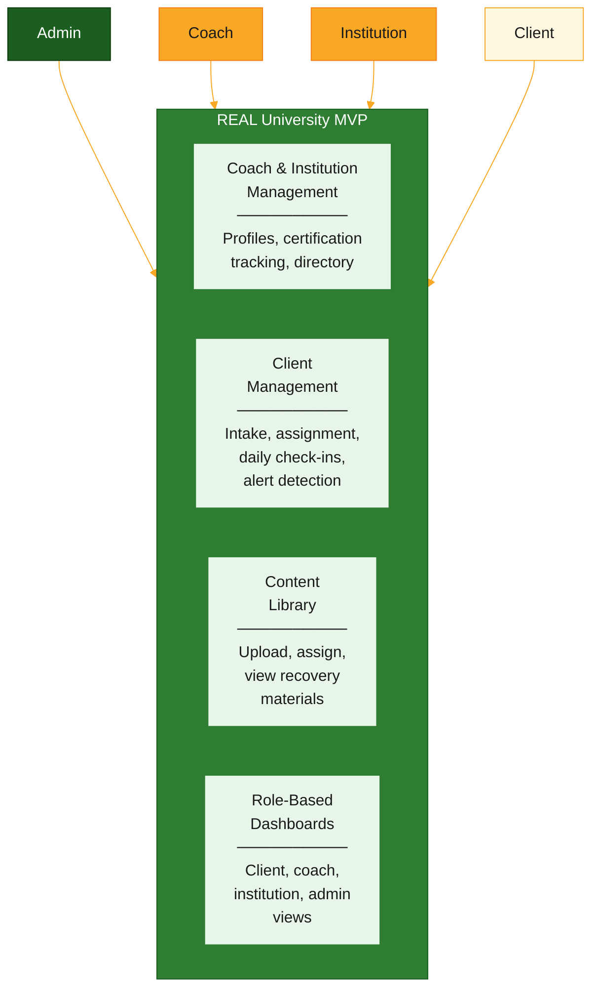
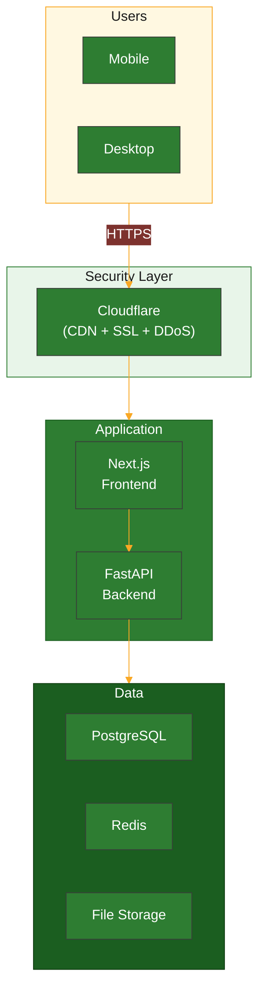
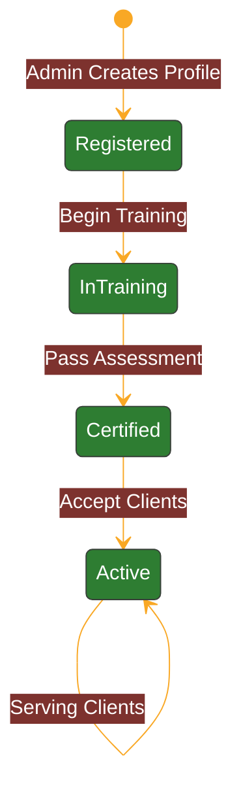
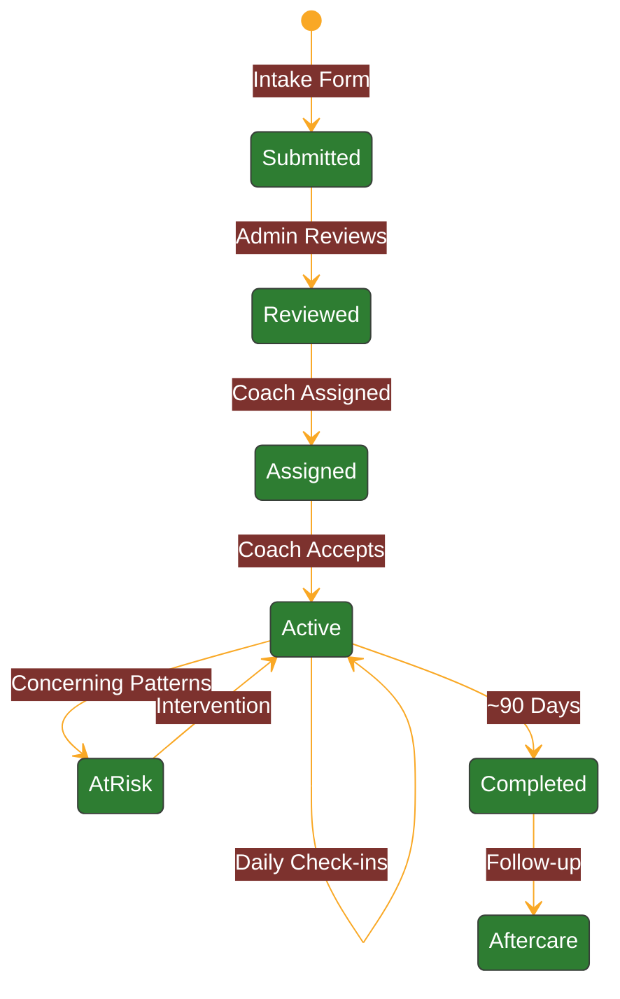
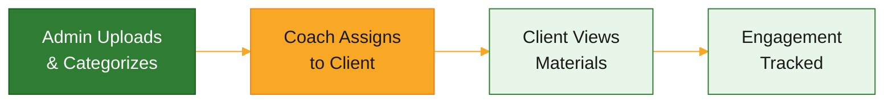
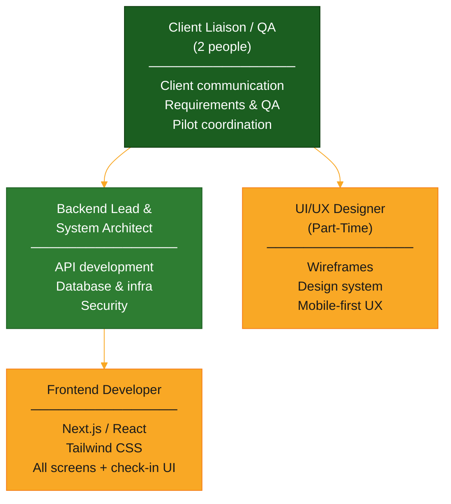
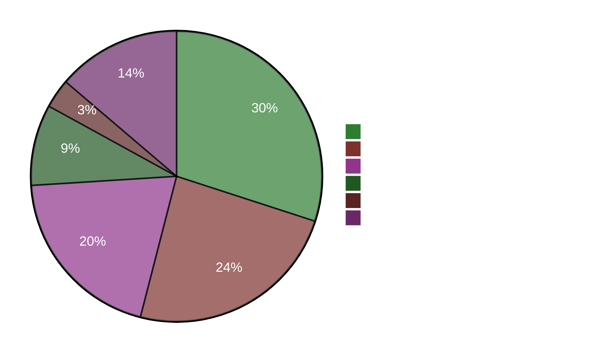

# REAL University Digital Platform

## Technical Concept, Resources, Cost Estimate & Delivery Timeline

---

**Prepared for:** Seth Oketch — Vision Holder, REAL University
**Date:** February 2026
**Version:** 2.1
**Scope:** Minimum Viable Product (MVP) — Core Recovery Workflow

---

## Table of Contents

1. [Executive Summary](#1-executive-summary)
2. [Technical Concept](#2-technical-concept)
3. [Required Resources](#3-required-resources)
4. [Cost Estimate](#4-cost-estimate)
5. [Delivery Timeline](#5-delivery-timeline)
6. [Risks & Mitigations](#6-risks--mitigations)
7. [Future Vision](#7-future-vision)
8. [Next Steps](#8-next-steps)

---

## 1. Executive Summary

After 24 years of refinement, the RIAB framework is proven. The next critical objective is **scale**.

This proposal outlines the approach to digitize Recovery In A Box (RIAB) into a secure, mobile-first digital platform under the REAL University umbrella. The MVP focuses on the **core recovery workflow** — getting clients into the system, tracking their daily progress, and giving coaches and admins real-time visibility into outcomes.

### What the MVP Delivers

### Key Numbers

| | |
| --- | --- |
| **Investment** | KSh 2,000,000 |
| **Delivery** | 4 months |
| **Team** | 5 people (+ part-time designer) |
| **Pilot Target** | 30-50 clients, 3-5 coaches, 1-2 institutions |
| **Technology** | Python/FastAPI + Next.js/React + PostgreSQL |

### Design Principles

- **Mobile-first** — Designed for phones on slow African networks
- **Secure** — Encrypted data, role-based access, full audit trail
- **Lean** — Low infrastructure cost; scales when demand justifies it
- **Extensible** — Architecture designed for future features without re-building

---

## 2. Technical Concept

### 2.1 Technology Stack

| Layer | Technology | Why It Matters |
| --- | --- | --- |
| **Frontend** | Next.js (React) + Tailwind CSS | Fast page loads on slow connections; mobile-first by default |
| **Backend** | Python / FastAPI | High-performance API with automatic documentation and validation |
| **Database** | PostgreSQL 16 | Battle-tested reliability; strong data integrity for health data |
| **Cache** | Redis | Fast session management; background job processing |
| **File Storage** | DigitalOcean Spaces (S3-compatible) | Secure, cost-effective storage for content library |
| **Hosting** | DigitalOcean VPS + Docker | Simple, predictable pricing; containerized for easy scaling |
| **Security** | Cloudflare (free tier) | CDN, SSL, DDoS protection, rate limiting — zero cost |

### 2.2 Architecture

### 2.3 Core Features

#### Coach & Institution Management

- Admin manages coach and institution profiles
- Certification status tracked through lifecycle
- Searchable directory of certified practitioners

#### Client Recovery Journey

- Structured intake with risk flagging
- Mobile-first daily check-ins — submittable in **<30 seconds**
- Mood, cravings, activities, and notes tracked daily
- **Automated alerts** when concerning patterns detected (missed check-ins, declining mood, high cravings)

#### Content Library

- Secure storage for PDFs, video, and audio (Sacred Scrolls, Teachings, Protocols)
- Clients only see materials assigned to them
- Engagement tracked (viewed / not viewed)

#### Role-Based Dashboards

| Dashboard | What It Shows |
| --- | --- |
| **Client** | Personal progress, check-in history, assigned materials |
| **Coach** | Active caseload, client alerts, check-in overview |
| **Institution** | All affiliated coaches, aggregate metrics, capacity |
| **Admin** | System-wide overview, all users, risk alerts |

### 2.4 Security

| Control | Implementation |
| --- | --- |
| **Encryption** | TLS 1.3 in transit; encrypted database connections |
| **Authentication** | JWT tokens with automatic expiry and refresh |
| **Authorization** | Role-based access enforced at every endpoint |
| **Passwords** | bcrypt hashing (industry standard) |
| **File access** | Time-limited signed URLs (1-hour expiry) |
| **Audit trail** | All sensitive operations logged with user, action, timestamp |
| **Backups** | Automated daily database backups with 30-day retention |
| **DDoS protection** | Cloudflare (free tier) |

---

## 3. Required Resources

### 3.1 Team

| Role | Duration |
| --- | --- |
| Client Liaison / QA (2 people) | 4 months |
| Backend Lead / System Architect | 4 months |
| Frontend Developer | 4 months |
| UI/UX Designer (part-time contract) | 3 months |

### 3.2 Infrastructure

| Service | Provider | ~Monthly Cost |
| --- | --- | --- |
| VPS (4GB RAM, 2 vCPU, Docker) | DigitalOcean | $48 |
| S3-compatible file storage | DigitalOcean Spaces | $15 |
| CDN + SSL + DDoS protection | Cloudflare (free tier) | $0 |
| Transactional email | AWS SES (free tier) | $0 |
| **Monthly total** | | **~$63** |

### 3.3 Content from REAL University

The following must be provided to populate the platform:

| Content | Format Needed | Required By | Blocks Launch? |
| --- | --- | --- | --- |
| Sacred Scrolls (initial set) | PDF or text | Month 2 | Yes |
| Core Teachings & Volumes | PDF, video, or audio | Month 2 | Yes |
| Intake Form Questions | Structured questionnaire | Month 1 | Yes |
| Recovery Phase Definitions | Phase names, milestones, criteria | Month 1 | Yes |
| Daily Check-in Question Set | Mood/craving scales, activity options | Month 1 | Yes |
| Additional teaching materials | Any digital format | Month 3 | No |

---

## 4. Cost Estimate

> All figures in Kenyan Shillings (KSh).

### 4.1 Investment Summary

| Category | Amount (KSh) |
| --- | --- |
| Backend Lead / System Architect | 600,000 |
| Frontend Developer | 480,000 |
| Client Liaison / QA (2 people) | 400,000 |
| UI/UX Designer (part-time) | 180,000 |
| Infrastructure (4 months @ ~KSh 8,200/mo) | 50,000 |
| Tools & Services (Figma, domain) | 15,000 |
| Contingency (14%) | 275,000 |
| **Total** | **2,000,000** |

### 4.2 Payment Structure

| Milestone | Trigger | Amount (KSh) |
| --- | --- | --- |
| **Kickoff** | Contract signed, development begins | 600,000 (30%) |
| **Month 2 Checkpoint** | Core workflows functional on staging | 600,000 (30%) |
| **MVP Delivery** | Platform live, pilot group onboarded | 800,000 (40%) |
| **Total** | | **2,000,000** |

### 4.3 Post-Launch Operating Costs

| Category | Monthly (USD) | Monthly (KSh) |
| --- | --- | --- |
| VPS + Storage | ~$63 | ~8,200 |
| Email + CDN | $0 (free tiers) | 0 |
| **Total** | **~$63** | **~8,200** |

> The platform runs at minimal cost post-launch. Future enhancements scoped and budgeted separately based on pilot feedback.

---

## 5. Delivery Timeline

### 5.1 Four-Month Plan

| Phase | Duration | Focus | Key Outcome |
| --- | --- | --- | --- |
| **Kickoff** | 1 week | Alignment, setup, wireframes | Scope locked, dev environment ready |
| **Month 1** | 4 weeks | Foundation | Auth, database, design system, dashboard shells |
| **Month 2** | 4 weeks | Core Workflows | Client intake, check-ins, assignments, alert engine |
| **Month 3** | 4 weeks | Content & Dashboards | Content library, dashboard data, email notifications |
| **Month 4** | 4 weeks | Polish & Launch | Testing, bug fixes, UAT, **pilot launch** |

### 5.2 Month-by-Month Deliverables

**Month 1 — Foundation**

| Track | Deliverables |
| --- | --- |
| Backend | Auth system (JWT + RBAC); user CRUD; database schema; staging deployed |
| Frontend | Login / registration; dashboard shells (4 roles); responsive layout; component library |
| Design | Design system (RIAB brand); wireframes for Months 1-2; hi-fi auth mockups |
| QA / Liaison | Content inventory started; test plan drafted; feedback loop established |

**Month 2 — Core Workflows**

| Track | Deliverables |
| --- | --- |
| Backend | Client intake API; assignment workflow; daily check-in API; alert engine |
| Frontend | Intake form (mobile); check-in UI (<30s submit); coach client list; admin dashboard |
| Design | Content library UI; check-in refinement; mobile testing |
| QA / Liaison | Core workflow testing; staging demo to client; feedback collected |

**Month 3 — Content & Dashboards**

| Track | Deliverables |
| --- | --- |
| Backend | Content library API; dashboard data APIs; email notification service |
| Frontend | Content library (admin); content viewer (client); dashboard charts; notifications |
| Content | Initial RIAB materials uploaded and categorized |
| QA / Liaison | Full workflow testing; security review; pilot users identified |

**Month 4 — Polish & Launch**

| Track | Deliverables |
| --- | --- |
| Testing | Integration testing; cross-browser; mobile device testing; security review |
| Polish | Bug fixes; performance optimization; UX refinements |
| UAT | Pilot coaches test real workflows; clients onboarded; issues fixed |
| Launch | Production deployed; backups verified; monitoring active; **PILOT LIVE** |

### 5.3 Key Milestones

| # | Milestone | Target | Success Criteria |
| --- | --- | --- | --- |
| M1 | Kickoff complete | Week 1 | Scope locked, environment ready, wireframes approved |
| M2 | Auth + dashboards on staging | Week 4 | Login works, 4 dashboards render |
| M3 | Core workflows on staging | Week 8 | Intake → assignment → check-in works end-to-end |
| M4 | First client demo | Week 8 | REAL University sees working staging demo |
| M5 | Content library live | Week 12 | Materials uploaded, assignable, viewable |
| M6 | UAT begins | Week 14 | Pilot coaches testing real workflows |
| **M7** | **MVP Pilot Launch** | **Week 16** | **30-50 clients actively using the platform** |

---

## 6. Risks & Mitigations

| Risk | Likelihood | Impact | Mitigation |
| --- | --- | --- | --- |
| **Content not provided on time** | Medium | High | Content audit in kickoff; liaison team drives weekly collection |
| **Scope creep** | High | High | Scope locked after kickoff; formal change request process |
| **Low pilot adoption** | Low | High | Involve pilot coaches in UX testing from Month 2; simplify onboarding |
| **Frontend hiring delay** | Medium | Medium | Begin recruiting before contract signing; backup candidates ready |
| **Slow network performance** | Medium | Medium | Test on simulated 3G from Month 1; check-in payload <2KB |

---

## 7. Future Vision

The MVP establishes the core recovery workflow. The architecture is designed with clear extension points for future capabilities — each to be scoped and budgeted based on pilot feedback.

| Future Capability | Description |
| --- | --- |
| M-Pesa payments | Mobile payment collection via Safaricom Daraja API |
| SMS notifications | Africa's Talking integration for alerts and reminders |
| Coach training (LMS) | Digital training modules with assessments and auto-certification |
| Herbal supplement tracking | Distribution logging, compliance monitoring, resupply alerts |
| Advanced reporting | Exportable reports (PDF, Excel, CSV), custom dashboards |
| Multi-language | Swahili support; framework for additional African languages |
| Offline mode | PWA with service workers for check-ins and content without internet |
| Native mobile app | iOS and Android apps consuming the same API |

> Future phases will be proposed based on pilot outcomes and stakeholder priorities. The MVP architecture ensures these can be added without re-building.

---

## 8. Next Steps

| # | Action | Owner |
| --- | --- | --- |
| 1 | Confirm alignment with this technical approach | Seth Oketch |
| 2 | Identify pilot partners (1-2 institutions, 3-5 coaches) | Seth Oketch |
| 3 | Provide core content (intake form structure, recovery phases, initial materials) | REAL University |
| 4 | Approve budget and payment structure | Seth Oketch |
| 5 | Schedule kickoff week | Both parties |

---

*This proposal is valid for 30 days from the date of issue.*
